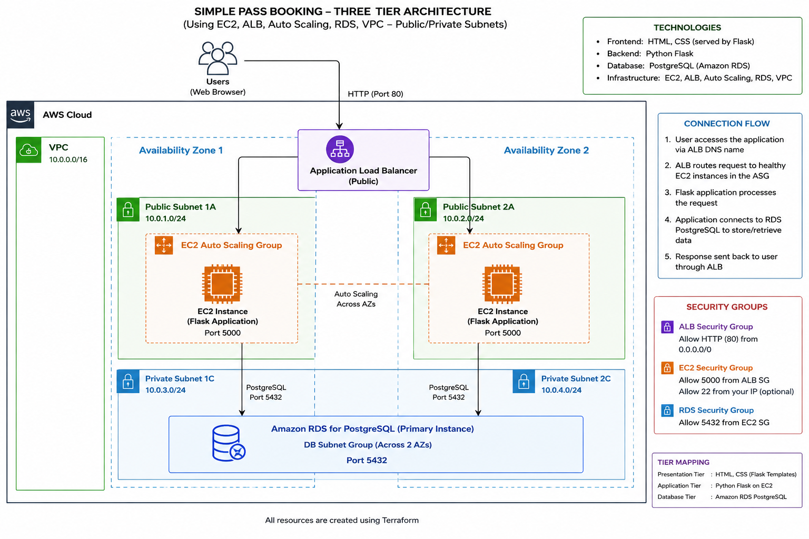

# Simple AWS Three-Tier Pass Booking System

A beginner-friendly project using only the core AWS services:

text
Amazon VPC
Amazon EC2
Application Load Balancer
EC2 Auto Scaling
Amazon RDS PostgreSQL


Terraform also creates the supporting networking and security resources required by those services:

text
Public and private subnets
Internet Gateway
Route tables
Security groups
Launch template
Target group
ALB listener


## Frontend design

The designed interface uses a modern travel/pass-booking style with:

text
Responsive hero section
CSS-only ticket illustration
Professional booking form
Modern confirmation page
Polished RDS records table
Mobile-responsive layout
No external image or JavaScript dependency


The application architecture and Terraform infrastructure are unchanged.

## Architecture

text
Customer browser
      |
      | HTTP
      v
Application Load Balancer
      |
      | Port 5000
      v
EC2 Auto Scaling Group
Flask + HTML + CSS
      |
      | PostgreSQL port 5432
      v
Private Amazon RDS PostgreSQL


The load balancer and application EC2 instances use two public subnets. RDS uses two private database subnets.

The EC2 instances have public IP addresses only so they can install Python packages without a NAT Gateway. Their security group does not allow direct public inbound traffic to the Flask port. Only the ALB security group can reach port 5000.

This is a deliberate beginner design. A later version can move EC2 into private application subnets and add a NAT Gateway or VPC endpoints.

## What the application does

The customer submits:

text
Full name
Email
Phone number
Pass type
Travel date


The Flask backend:

1. Receives the HTML form.
2. Validates the information.
3. Creates a booking reference.
4. Inserts a row into PostgreSQL.
5. Commits the database transaction.
6. Displays a confirmation page.

The 
/bookings page lists stored records so you can prove that RDS is receiving the data. It has no authentication, so use only dummy information.

## Run locally

bash
cd app
python -m venv venv


Activate the environment.

Linux or macOS:

bash
source venv/bin/activate


Windows PowerShell:

powershell
.\venv\Scripts\Activate.ps1


Install and start:

bash
pip install -r requirements.txt
python app.py


Open:

text
http://localhost:5000


Local development uses SQLite automatically. AWS uses PostgreSQL automatically through environment variables created by Terraform.

## Deploy to AWS

Follow:

text
docs/STEP_BY_STEP_GUIDE.md


## Important limitation

This learning version uses HTTP, has no login system, and exposes the demonstration 
/bookings page. Do not use real customer information. You have to redo this readme with a natural tone like me writing it and make sure to add the architecture diagram 

Generated image: AWS three-tier pass booking system diagram

I rewrote the README in a more natural, first-person tone and added an architecture diagram that matches the actual Terraform configuration, including the correct VPC and subnet CIDR ranges.

The diagram now correctly shows:

VPC: 10.20.0.0/16

Public Subnet 1: 10.20.0.0/24
Public Subnet 2: 10.20.1.0/24

Private DB Subnet 1: 10.20.10.0/24
Private DB Subnet 2: 10.20.11.0/24

Internet → ALB port 80
ALB → EC2 port 5000
EC2 → RDS port 5432


Library
/README.md

# Simple AWS Three-Tier Pass Booking System

This is a simple three-tier pass booking application that I built to understand how a frontend, backend and database work together on AWS.

A customer completes a booking form on the website. The Python Flask application processes the form and stores the booking in an Amazon RDS PostgreSQL database.

## Architecture



The request follows this path:

```text
User
  → Application Load Balancer
  → EC2 instances in an Auto Scaling Group
  → Amazon RDS PostgreSQL
```

## Technologies used

- **Frontend:** HTML and CSS
- **Backend:** Python Flask
- **Database:** Amazon RDS PostgreSQL
- **Infrastructure:** Terraform
- **AWS services:** VPC, EC2, Application Load Balancer, Auto Scaling and RDS

## Project structure

```text
simple-aws-three-tier-booking/
├── app/
│   ├── app.py
│   ├── requirements.txt
│   ├── static/
│   └── templates/
│
├── terraform/
│   ├── network.tf
│   ├── security.tf
│   ├── alb.tf
│   ├── compute.tf
│   ├── rds.tf
│   ├── variables.tf
│   └── outputs.tf
│
├── docs/
│   └── architecture-diagram.png
│
└── README.md
```

## Run the project locally

Move into the application folder:

```bash
cd app
```

Create a Python virtual environment:

```bash
python -m venv venv
```

Activate it on Windows PowerShell:

```powershell
.\venv\Scripts\Activate.ps1
```

Activate it on Linux or macOS:

```bash
source venv/bin/activate
```

Install the required packages:

```bash
pip install -r requirements.txt
```

Start the application:

```bash
python app.py
```

Open the website in your browser:

```text
http://localhost:5000
```

The local version uses SQLite automatically.

## Deploy the project to AWS

First, make sure Terraform and the AWS CLI are installed and that your AWS credentials are configured.

Check your AWS account:

```bash
aws sts get-caller-identity
```

Move into the Terraform folder:

```bash
cd terraform
```

Create your Terraform variables file.

Windows PowerShell:

```powershell
Copy-Item terraform.tfvars.example terraform.tfvars
```

Linux or macOS:

```bash
cp terraform.tfvars.example terraform.tfvars
```

Initialize Terraform:

```bash
terraform init
```

Format and validate the files:

```bash
terraform fmt -recursive
terraform validate
```

Create a Terraform plan:

```bash
terraform plan -out=booking.tfplan
```

Apply the plan:

```bash
terraform apply booking.tfplan
```

After the deployment completes, display the website address:

```bash
terraform output website_url
```

Open the address in your browser.

## Test the application

1. Open the website using the ALB address.
2. Complete the booking form using dummy information.
3. Submit the form.
4. Confirm that a booking reference is displayed.
5. Open the bookings page:

```text
http://ALB-DNS-NAME/bookings
```

The submitted booking should appear on the page. This confirms that the Flask application successfully stored the data in RDS PostgreSQL.

## Check the load balancer targets

Run:

```bash
aws elbv2 describe-target-health \
  --target-group-arn "$(terraform output -raw target_group_arn)"
```

The EC2 targets should show as:

```text
healthy
```

## Remove the AWS resources

The project creates resources that may generate AWS charges.

When I finish testing, I remove the infrastructure with:

```bash
terraform destroy
```

## Important note

This is a learning project. It currently uses HTTP, does not have user authentication and exposes the `/bookings` page.

Only dummy customer information should be used.

Library
/README.md

# Simple AWS Three-Tier Pass Booking System

This is a simple three-tier pass booking application that I built to understand how a frontend, backend and database work together on AWS.

A customer completes a booking form on the website. The Python Flask application processes the form and stores the booking in an Amazon RDS PostgreSQL database.

## Architecture


The request follows this path:

```text
User
  → Application Load Balancer
  → EC2 instances in an Auto Scaling Group
  → Amazon RDS PostgreSQL
```

## Technologies used

- **Frontend:** HTML and CSS
- **Backend:** Python Flask
- **Database:** Amazon RDS PostgreSQL
- **Infrastructure:** Terraform
- **AWS services:** VPC, EC2, Application Load Balancer, Auto Scaling and RDS

## Project structure

```text
simple-aws-three-tier-booking/
├── app/
│   ├── app.py
│   ├── requirements.txt
│   ├── static/
│   └── templates/
│
├── terraform/
│   ├── network.tf
│   ├── security.tf
│   ├── alb.tf
│   ├── compute.tf
│   ├── rds.tf
│   ├── variables.tf
│   └── outputs.tf
│
├── docs/
│   └── architecture-diagram.png
│
└── README.md
```

## Run the project locally

Move into the application folder:

```bash
cd app
```

Create a Python virtual environment:

```bash
python -m venv venv
```

Activate it on Windows PowerShell:

```powershell
.\venv\Scripts\Activate.ps1
```

Activate it on Linux or macOS:

```bash
source venv/bin/activate
```

Install the required packages:

```bash
pip install -r requirements.txt
```

Start the application:

```bash
python app.py
```

Open the website in your browser:

```text
http://localhost:5000
```

The local version uses SQLite automatically.

## Deploy the project to AWS

First, make sure Terraform and the AWS CLI are installed and that your AWS credentials are configured.

Check your AWS account:

```bash
aws sts get-caller-identity
```

Move into the Terraform folder:

```bash
cd terraform
```

Create your Terraform variables file.

Windows PowerShell:

```powershell
Copy-Item terraform.tfvars.example terraform.tfvars
```

Linux or macOS:

```bash
cp terraform.tfvars.example terraform.tfvars
```

Initialize Terraform:

```bash
terraform init
```

Format and validate the files:

```bash
terraform fmt -recursive
terraform validate
```

Create a Terraform plan:

```bash
terraform plan -out=booking.tfplan
```

Apply the plan:

```bash
terraform apply booking.tfplan
```

After the deployment completes, display the website address:

```bash
terraform output website_url
```

Open the address in your browser.

## Test the application

1. Open the website using the ALB address.
2. Complete the booking form using dummy information.
3. Submit the form.
4. Confirm that a booking reference is displayed.
5. Open the bookings page:

```text
http://ALB-DNS-NAME/bookings
```

The submitted booking should appear on the page. This confirms that the Flask application successfully stored the data in RDS PostgreSQL.

## Check the load balancer targets

Run:

```bash
aws elbv2 describe-target-health \
  --target-group-arn "$(terraform output -raw target_group_arn)"
```

The EC2 targets should show as:

```text
healthy
```

## Remove the AWS resources

The project creates resources that may generate AWS charges.

When I finish testing, I remove the infrastructure with:

```bash
terraform destroy
```

## Important note

This is a learning project. It currently uses HTTP, does not have user authentication and exposes the `/bookings` page.

Only dummy customer information should be used.

