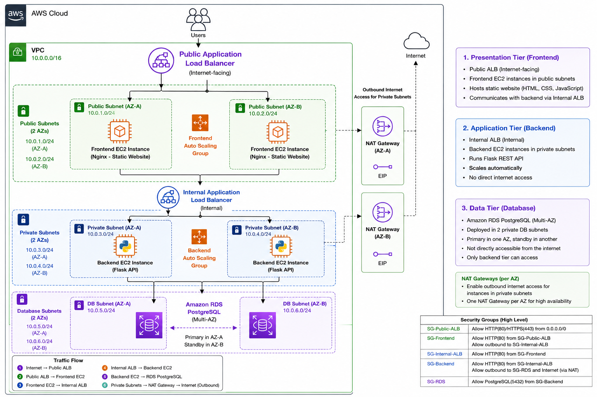

# Simple AWS Three-Tier Pass Booking System

This is a cloud-native three-tier pass booking application deployed on AWS using Terraform.

A customer completes a booking form hosted by the frontend application. The request is forwarded to a Flask backend through an internal Application Load Balancer, where it is processed and stored in an Amazon RDS PostgreSQL database. The application is deployed across multiple Availability Zones using Auto Scaling Groups for high availability.

## Architecture



The request follows this path:

```text
User
  Internet
    │
    ▼
Public Application Load Balancer
    │
    ▼
Frontend Auto Scaling Group (Nginx)
    │
    ▼
Internal Application Load Balancer
    │
    ▼
Backend Auto Scaling Group (Flask + Gunicorn)
    │
    ▼
Amazon RDS PostgreSQL
```

## Technologies used

- **Frontend:** HTML, CSS, JavaScript, Nginx
- **Backend:** Python, Flask, Gunicorn
- **Database:** Amazon RDS PostgreSQL
- **Infrastructure:** Terraform
- **AWS Services:** VPC, EC2, Application Load Balancer, Auto Scaling Groups, Amazon RDS, Internet Gateway, NAT Gateway and Security Groups

## Project structure

```text
simple-aws-three-tier-booking/
├── backend/
│   ├── app.py
│   ├── requirements.txt
│   └── ...
│
├── frontend/
│   ├── index.html
│   ├── bookings.html
│   ├── success.html
│   ├── js/
|   |   ├── api.js
|   |   ├── bookings.js
|   |   ├── config.js
|   |   ├── index.js
│   |   └── booking.js
|   |    
|   |    
│   ├── css/
|       ├── style.css
│       └── style.min.css
│   
│
├── terraform/
│   ├── alb.tf
│   ├── compute.tf
│   ├── data.tf
│   ├── network.tf
│   ├── outputs.tf
│   ├── providers.tf
│   ├── rds.tf
│   ├── security.tf
│   ├── variables.tf
│   ├── versions.tf
│   ├── terraform.tfvars.example
│   └── user_data/
│       ├── backend.sh
│       └── frontend.sh
│
├── docs/
│   └── architecture-diagram.png
│
└── README.md
```

## Run the project locally

Move into the application folder:

```bash
cd backend
```

Create a Python virtual environment:

```bash
python -m venv venv
```

Activate it on Windows PowerShell:

```powershell
.\venv\Scripts\Activate.ps1
```

Activate it on Linux or macOS:

```bash
source venv/bin/activate
```

Install the required packages:

```bash
pip install -r requirements.txt
```

Start the application:

```bash
python app.py
```

Open the website in your browser:

```text
http://localhost:5000
```

The local version uses SQLite automatically. The frontend automatically communicates with the local Flask backend when running on localhost.

## Deploy the project to AWS

First, make sure Terraform and the AWS CLI are installed and that your AWS credentials are configured.

Check your AWS account:

```bash
aws sts get-caller-identity
```

Move into the Terraform folder:

```bash
cd terraform
```

Create your Terraform variables file.

Windows PowerShell:

```powershell
Copy-Item terraform.tfvars.example terraform.tfvars
```

Linux or macOS:

```bash
cp terraform.tfvars.example terraform.tfvars
```

Initialize Terraform:

```bash
terraform init
```

Format and validate the files:

```bash
terraform fmt -recursive
terraform validate
```

Create a Terraform plan:

```bash
terraform plan -out=booking.tfplan
```

Apply the plan:

```bash
terraform apply booking.tfplan
```

After the deployment completes, display the website address:

```bash
terraform output website_url
```

Open the address in your browser.

## Test the application

1. Open the website using the ALB address.
2. Complete the booking form using dummy information.
3. Submit the form.
4. Confirm that a booking reference is displayed.
5. Open the bookings page:

```text
http://PUBLIC-ALB-DNS-NAME/bookings.html
```

The submitted booking should appear on the page. This confirms that the Flask application successfully stored the data in RDS PostgreSQL.

## Check the load balancer targets

Run:

```bash
aws elbv2 describe-target-health \
  --target-group-arn "$(terraform output -raw target_group_arn)"
```

The EC2 targets should show as:

```text
healthy
```

## Remove the AWS resources

The project creates resources that may generate AWS charges.

When I finish testing, I remove the infrastructure with:

```bash
terraform destroy
```

## Important note

This is a learning project. It currently uses HTTP, does not have user authentication and exposes the `/bookings` page.

Only dummy customer information should be used.

## Future Improvements

The following enhancements could be implemented to make the application more production-ready:

- **HTTPS with AWS Certificate Manager (ACM)** to encrypt traffic using SSL/TLS.
- **Route 53 custom domain** for a user-friendly application URL.
- **CI/CD pipeline with GitHub Actions** to automate testing and deployments.
- **Blue/Green deployments** to enable zero-downtime application releases.
- **Amazon CloudWatch dashboards and alarms** for monitoring application health and infrastructure performance.
- **Amazon SNS notifications** to send email alerts for infrastructure events, deployment status, or new booking confirmations.
- **AWS Secrets Manager** to securely store and manage database credentials and application secrets.
- **AWS WAF (Web Application Firewall)** to protect the application from common web exploits and attacks.
- **Database migrations with Alembic** for version-controlled schema changes.
- **Containerization with Docker and deployment to Amazon ECS** for improved portability and orchestration.

